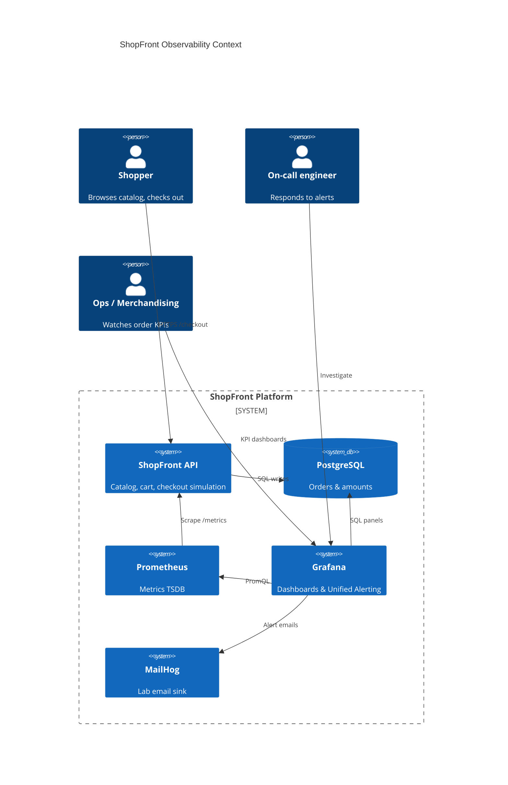
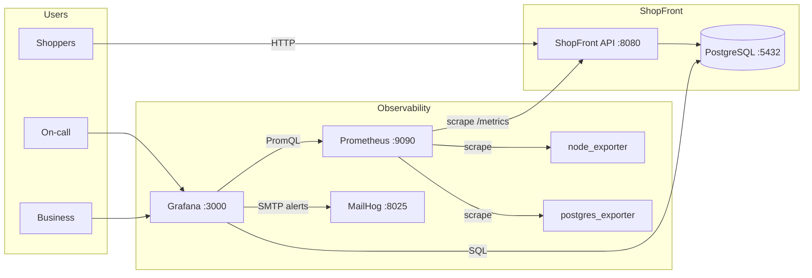
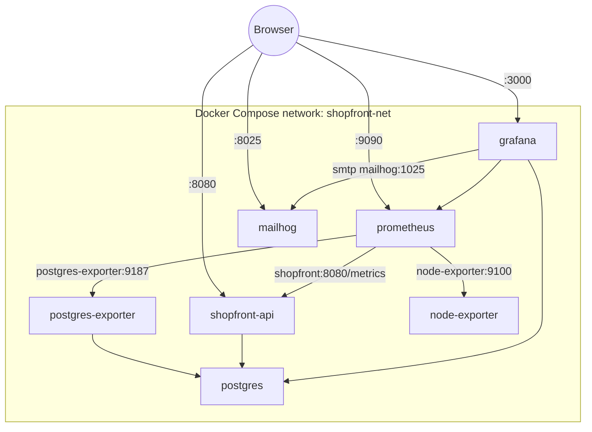
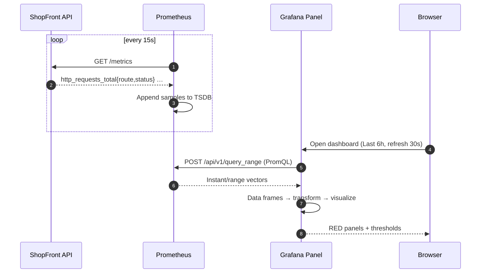
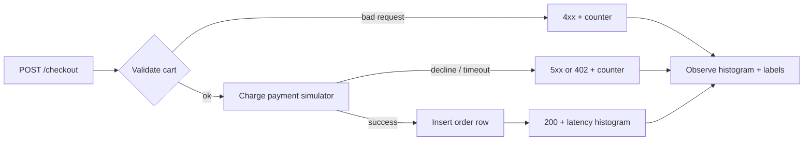
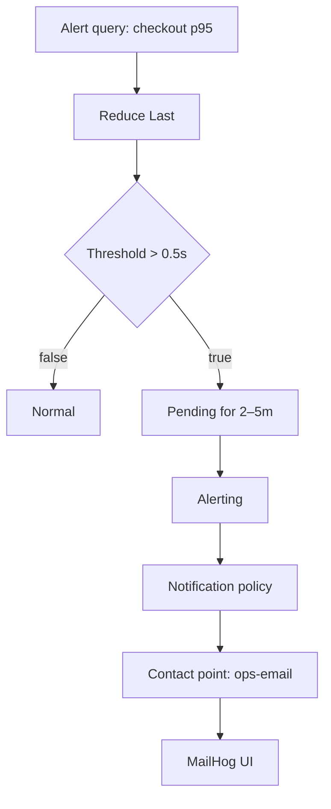
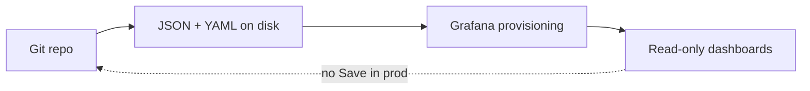
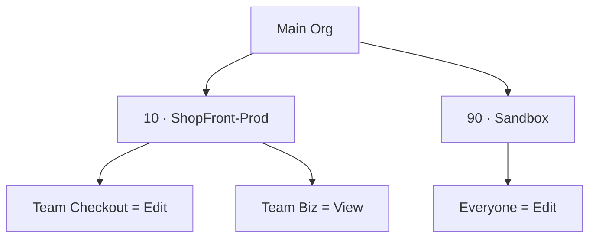

# ShopFront - Architecture Diagrams

Open this file in any Markdown preview that supports **Mermaid** (VS Code / Cursor preview, GitHub, etc.).

Companion `.mmd` sources live in [`diagrams/`](diagrams/) for export to PNG/SVG via [mermaid.live](https://mermaid.live).

---

## 1. Context - who talks to what

> If C4 Mermaid is unsupported in your preview, use the flowchart below.

---

## 2. Container / lab deployment view

---

## 3. Metrics pipeline (how a panel gets data)

---

## 4. Checkout request path (business + metrics)

---

## 5. Alerting path (Unified Alerting)

---

## 6. Dashboards as code (Day 5 discipline)

---

## 7. Folder & permission sketch (production mindset)

---

## Ports quick reference

| Port | Service |
|---|---|
| 3000 | Grafana |
| 8080 | ShopFront API |
| 9090 | Prometheus |
| 9100 | node_exporter |
| 9187 | postgres_exporter |
| 5432 | PostgreSQL |
| 1025 / 8025 | MailHog SMTP / UI |
